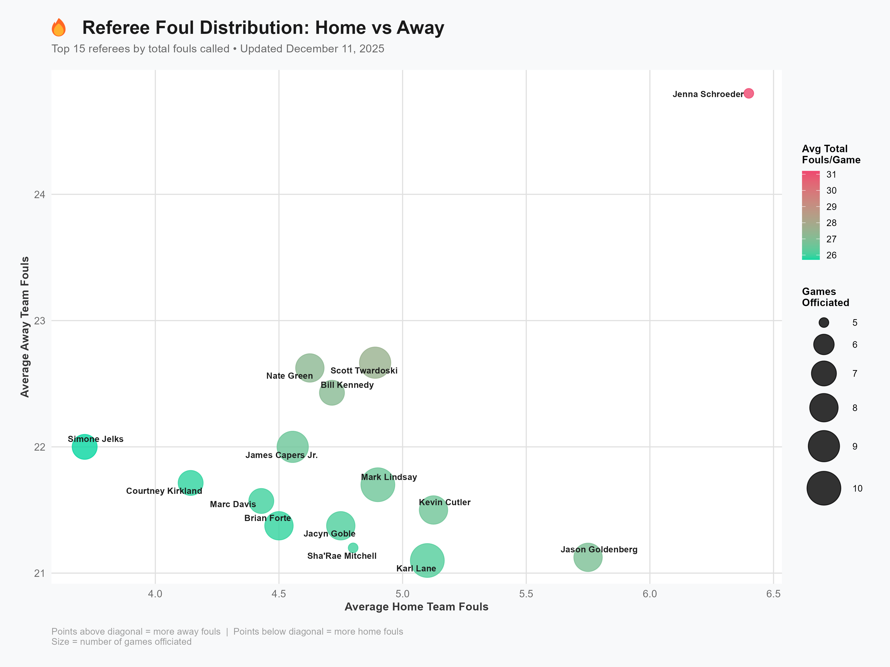

# NBA Referee Bias Tracker

Latest update: Thu Dec 12 06:00:00 UTC 2024

Hello, my name is Taha Shah, and this is my project.

This project tracks potential bias patterns in NBA referee foul calling using live game data from Basketball Reference. The goal is to determine whether NBA referees show systematic differences in how they call fouls on home versus away teams. Game data including teams, scores, foul counts, and referee assignments are scraped daily from Basketball Reference's box score pages. A GitHub Actions workflow runs automatically every day at 6 AM UTC, executing R scripts that download the latest completed games, extract referee crews and team foul statistics, clean and validate the data, and append new observations to a growing dataset stored in the repository. This automated pipeline means the analysis stays current without manual intervention, demonstrating how reproducible workflows can maintain an always-updated view of officiating patterns throughout the NBA season.

The data is processed in R using tidyverse tools to handle missing values, standardize team names, compute foul differentials (home fouls minus away fouls), and calculate referee-specific bias metrics by averaging these differentials across all games each official has worked. The resulting visualizations are designed for audiences with no statistical background: a horizontal bar chart color-coded by bias direction shows which referees call more fouls on home versus away teams, a scatter plot reveals the relationship between home and away foul rates for each referee, and a grouped bar chart directly compares average home and away fouls side by side. These charts make it easy to see patterns—for example, whether certain referees consistently favor one side, or whether most officials call games relatively evenly.

## Visualizations

### REFEREE BIAS

### REFEREE SCATTER

### REFEREE GROUPED

## Project Overview

This project analyzes potential bias in NBA officiating by tracking foul-calling patterns across referees and games. Data comes from Basketball Reference, which publishes detailed box scores for every NBA game including team statistics and referee assignments. The site updates within hours after each game concludes, making it possible to maintain a current dataset throughout the season. Understanding referee behavior matters because foul calling directly impacts game outcomes—more fouls can lead to free throws, bonus situations, and foul trouble for key players. If systematic biases exist, they could affect competitive balance.

The core of the project is an automated data pipeline built with GitHub Actions and R. A scheduled workflow runs once per day at 6 AM UTC (1 AM EST). It executes three R scripts in sequence. The first script (`scrape.R`) scrapes yesterday's completed games from Basketball Reference, extracting game dates, team names, final scores, team foul totals, and the three-referee crew for each game. The second script (`clean.R`) loads this raw data, removes duplicates, calculates derived metrics like foul differential and win/loss indicators, and appends the cleaned rows to an accumulated historical dataset stored as `data/games.csv`. The third script (`visualize.R`) reads the full dataset, reshapes it so each referee appears once per game they worked, computes bias metrics by averaging foul differentials, filters to referees with at least 5 games for statistical reliability, and generates three publication-quality visualizations saved to the `plots/` folder.

The visualizations are designed to be interpretable without specialized knowledge. The primary chart is a horizontal bar chart showing the top 20 referees ranked by absolute bias magnitude. Bars extending to the right (red) indicate more fouls called on the home team, while bars extending left (blue) indicate more fouls on the away team. A dashed line at zero marks perfect balance. The second visualization is a scatter plot where each point represents a referee, with the x-axis showing average home fouls and the y-axis showing average away fouls. Points above the diagonal line call more away fouls; points below call more home fouls. Point size indicates games worked, and color intensity shows total foul rate. The third chart uses grouped bars to directly compare home versus away fouls for the 12 most active referees, making gaps immediately visible. Together, these plots reveal whether individual officials show consistent patterns and whether the league as a whole has a home-court advantage in officiating.

The most challenging aspect was building a scraper robust enough to run unattended in the cloud. Basketball Reference uses rate limiting and anti-bot measures, so the scraper needed realistic browser headers, exponential backoff on 429 errors, and delays between requests to avoid being blocked. The HTML structure also varies—some games have all three referees listed, others have fewer, and column positions for fouls can shift. The scripts had to handle missing data gracefully, convert numeric columns that sometimes come as strings, and ensure date parsing worked consistently across time zones. Testing locally versus in GitHub Actions revealed differences in library versions and file paths. Overcoming these issues required defensive programming: validating every extraction step, using `try-catch` blocks, logging progress, and creating fallback behaviors when data is incomplete. The result is a pipeline that runs daily, survives edge cases like off-days with no games, and keeps the dataset and visualizations current with minimal maintenance. This project demonstrates how to automate sports analytics workflows and turn raw web data into clear visual stories about patterns in officiating.
